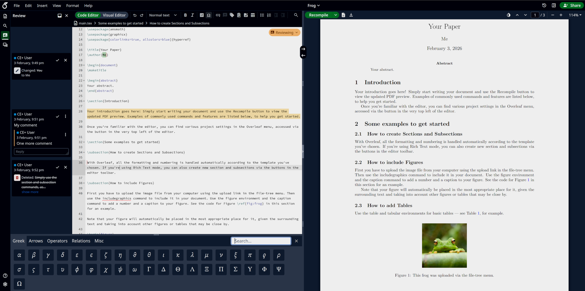

<h1 align="center">
  <br>
  
</h1>

<h4 align="center">An open-source, free, online real-time collaborative LaTeX editor.</h4>

<p align="center">
  <a href="https://github.com/davrot/6.3.0_post">Source</a> •
  <a href="#license">License</a>
</p>


<p align="center">
  Figure 1: A project being edited in OlliTeX.
</p>

## OlliTeX

**OlliTeX is a fork of [Overleaf Community Edition](https://github.com/overleaf/overleaf)
(open source, GNU AGPL v3)** — extended and maintained as a free, self-hostable
product. Overleaf runs a hosted commercial service at
[www.overleaf.com](https://www.overleaf.com); OlliTeX contains no subscription,
billing, or paid-plan components, and no advertising of premium services.

This fork builds on three open-source lineages (see [`CREDITS`](CREDITS.md)):

- [Overleaf Community Edition](https://github.com/overleaf/overleaf) (Copyright Overleaf, AGPL v3)
- [overleaf-cep](https://github.com/yu-i-i/overleaf-cep) "Extended CE" extensions by yu-i-i
- The 6.3.0 port + extension work in this repository (davrot)

## Features

This "extended" edition of Overleaf CE includes:

- Sandboxed compiles with TeX Live image selection
- Sign Up page
- LDAP authentication
- SAML authentication
- OpenID Connect authentication
- Real-time track changes and comments
- Symbol palette
- Template gallery
- Import file from external URL
- Git integration
- GitHub synchronization
- AI Assistant: LLM-powered chat, inline completion, compliance review, and
  grammar checking (LanguageTool and/or LLM, per-user settings + admin control
  page, plus an optional self-hosted LanguageTool service)
- Zotero integration
- Reference Search and Pick Tool
- Document Import (`.docx`, `.md`) and Export (`.docx`, `.md`, `.html`)
- Advanced administrator tools for managing user accounts and projects
- Logo tools

> [!CAUTION]
> Community Edition is intended for use in environments where **all** users are
> trusted. It is **not** appropriate for scenarios where isolation of users is
> required due to Sandbox Compiles not being available. When not using
> Sandboxed Compiles, users have full read and write access to the `sharelatex`
> container resources (filesystem, network, environment variables) when running
> LaTeX compiles. Therefore, in any environment where not all users can be
> fully trusted, it is strongly recommended to use Sandboxed Compiles.

## Installation

Build the server image from `server-ce/`:

```
cd server-ce
make all          # builds sharelatex/sharelatex:<rev> (+ TeX Live base image)
```

The [`Dockerfile-base`](server-ce/Dockerfile-base) builds the
`sharelatex/sharelatex-base:*` image (dependencies + TeX Live), and
[`Dockerfile`](server-ce/Dockerfile) builds
`sharelatex/sharelatex:*` on top of it.

The [Phusion base-image](https://github.com/phusion/baseimage-docker)
(extended by the `base` image) provides a VM-like container in which to run the
services. Baseimage uses the `runit` service manager to manage services, and
init scripts from the `server-ce/runit` folder are added.

A ready-to-run deployment example (nginx + overleaf + mongo + redis) lives in
`develop/docker-compose.yml`; a disposable end-to-end test stack (12 journey
tests, self-seeding fixtures) lives in [`tests/e2e`](tests/e2e) — see
[`tests/e2e/README.md`](tests/e2e/README.md) for `stack-up` /
`playwright test` / `stack-down`.

## Development

- In-repo regression tests: `cd services/web && yarn test:unit` (Vitest) and
  the frontend suite (Mocha) — see `services/web/package.json` scripts.
- `ext_explain.md` documents the extension surface (features, settings,
  module wiring) for the whole fork.
- `BRANDING.md` documents the OlliTeX branding and how to swap the logo set.

## Testing

The end-to-end test suite in [`tests/e2e`](tests/e2e) covers: smoke
(login → project → compile → PDF), admin site settings, BYO LLM providers,
grammar checking, keybindings, notifications, Zotero, and WebDAV/Dropbox
graceful behavior. The suite's structure and approach were inspired by the
testing practices of [Forgejo](https://codeberg.org/forgejo/forgejo).

## Authors

- [The Overleaf Team](https://www.overleaf.com/about) — Community Edition
- [yu-i-i](https://github.com/yu-i-i) — Extended CE features; adapted code
  listed in [`CREDITS`](CREDITS.md)
- [davrot](https://github.com/davrot) — 6.3.0 port, extensions, and
  maintenance of this fork

## License

The code in this repository is released under the GNU AFFERO GENERAL PUBLIC
LICENSE, version 3. A copy can be found in the [`LICENSE`](LICENSE) file.

Copyright (c) Overleaf, 2014-2026.\
Copyright (c) @yu-i-i, 2024-2026, for the Extended CE features.\
Copyright (c) @davrot, 2025-2026, for the 6.3.0 port and extensions.

Portions of the code are derived from other open-source projects; see
[`CREDITS`](CREDITS.md).
